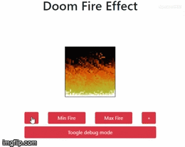

# Doom Fire Effect

> See this project runnig [here](https://thiagokienbaum.github.io/doom-fire-effect/).

This project was inspired by this [article](https://fabiensanglard.net/doom_fire_psx/) and this [video](https://youtu.be/fxm8cadCqbs).

## Meta
Thiago Kienbaum – [LinkedIn](https://www.linkedin.com/in/thiago-kienbaum/) – thiago.kienbaum@hotmail.com
